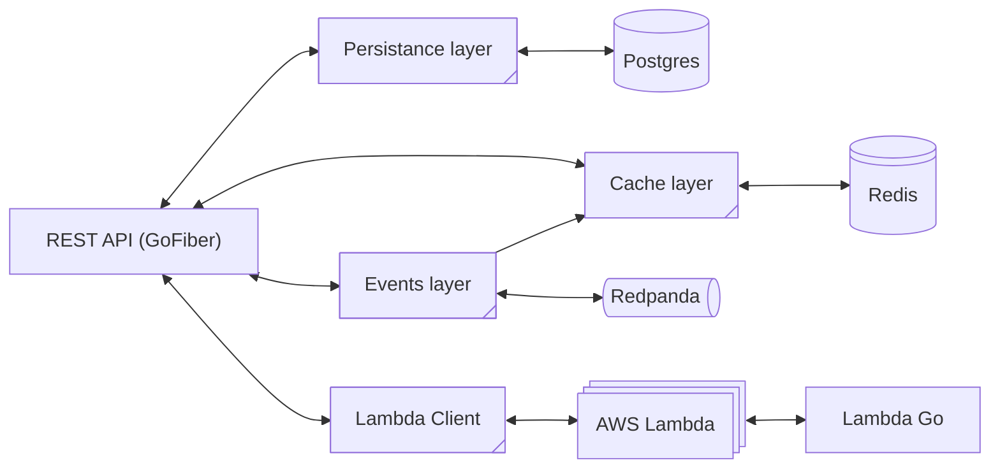
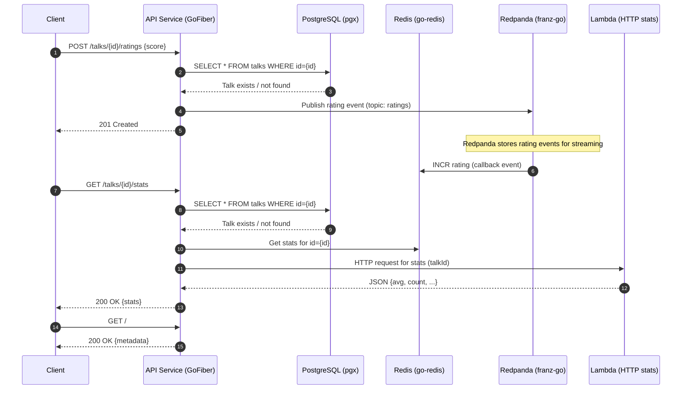

# Step 2: Exploring the app

The app is a simple microservice for rating conference talks. It provides a web API to track the ratings of the talks in real time, storing the results in a PostgreSQL database and a Redis cache, and using Redpanda as a broker for the event stream. Finally, it will use an AWS lambda function to calculate some statistics about the ratings of a talk.

## Storage layer

### SQL database with the talks

When a rating is submitted, we must verify that the talk for the given ID is present in the database.

The database of choice is PostgreSQL, accessed with [jackc/pgx](https://github.com/jackc/pgx) PostgreSQL Driver.

Check `internal/talks/repo.go`.

### Redis

The application stores the ratings in a Redis store with [redis/go-redis](https://github.com/redis/go-redis) Redis client.

Check `internal/ratings/repo.go`.

### Redpanda

The application uses ES/CQRS to materialize the events into the state. Redpanda acts as a broker and the [twmb/franz-go](https://github.com/twmb/franz-go) Kafa client.

Check `internal/streams/broker.go`.

## Cloud layer

### AWS Lambdas

The application uses AWS lambda functions to calculate some rating statistics of a talk. The lambda functions are invoked by the application when the ratings for a talk are requested, using HTTP calls to the function URL of the lambda.

Check `internal/ratings/lambda_client.go`.

### Go Lambda

The Go lambda application will live in the `lambda-go` directory. It is a simple lambda function that receives the talk ID and returns some statistics of the talk.

We'll start adding the code for the lambda in the `Step 7`.

## Web application

### API

The API is a [GoFiber](https://gofiber.io/) REST controller and exposes three endpoints:

* `POST /ratings { "talkId": ?, "value": 1-5 }` to add a rating for a talk
* `GET /ratings?talkId=?` to get the histogram of ratings of the given talk
* `GET /` returns metadata about the application, including the connection strings to all the backend services (PostgreSQL, Redis, Redpanda).

Check `internal/app/handlers.go`.

The sequence diagram for the entire flow is the following:

### 
[Next: Running the app locally](step-3-running-the-app-locally.md)
